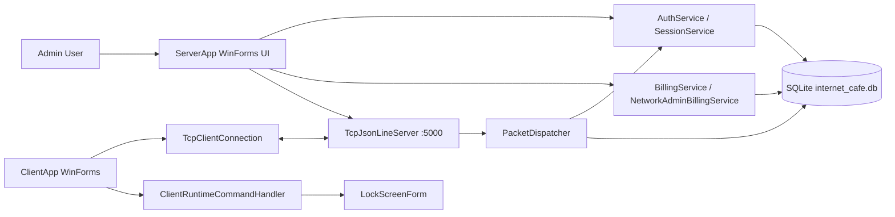

# NetManager Realtime Internet Cafe Management System

NetManager là hệ thống quản lý phòng máy Internet Cafe viết bằng C#/.NET 8, gồm ứng dụng quản trị, ứng dụng máy trạm và thư viện giao thức dùng chung. Dự án hiện dùng Windows Forms, TCP JSON-line và SQLite để quản lý đăng nhập, trạng thái máy, điều khiển máy, chat, thông báo, khách hàng và tính tiền theo phiên sử dụng.

> Trạng thái đã xác minh: `ServerApp` và `ClientApp` build thành công riêng lẻ. Build toàn solution hiện lỗi ở `ContractSmoke` vì thiếu type `TcpClientConnection`.

## Mục Lục

- [Tổng quan](#tổng-quan)
- [Tính năng](#tính-năng)
- [Cấu trúc project](#cấu-trúc-project)
- [Kiến trúc](#kiến-trúc)
- [Công nghệ](#công-nghệ)
- [Cài đặt](#cài-đặt)
- [Chạy ứng dụng](#chạy-ứng-dụng)
- [Cấu hình](#cấu-hình)
- [Giao thức mạng](#giao-thức-mạng)
- [Thuật toán và mô hình tính toán](#thuật-toán-và-mô-hình-tính-toán)
- [Database](#database)
- [Output đã xác minh](#output-đã-xác-minh)
- [Testing](#testing)
- [Dependencies](#dependencies)
- [Contributing](#contributing)
- [License](#license)
- [Future Improvements](#future-improvements)

## Tổng Quan

Project giải quyết bài toán quản lý phòng máy theo mô hình server-client:

- `ServerApp`: ứng dụng quản trị chạy trên máy chủ, đăng nhập admin, mở TCP server, theo dõi trạng thái máy, gửi lệnh điều khiển, quản lý khách hàng và tính tiền.
- `ClientApp`: ứng dụng chạy trên máy trạm, đăng nhập client, giữ kết nối TCP tới server, nhận lệnh lock/unlock/shutdown, nhận timer billing, chat và thông báo.
- `Shared`: hợp đồng packet, DTO, enum và helper JSON dùng chung giữa server/client.
- Các project smoke/auth test kiểm tra từng phần giao thức, xác thực, database và billing.

Đối tượng sử dụng chính là người quản trị phòng máy và các máy trạm trong mạng nội bộ.

## Tính Năng

Các tính năng dưới đây được xác định trực tiếp từ source code hiện tại:

- Đăng nhập admin/client bằng tài khoản, mật khẩu, role và `MachineId`.
- Seed tài khoản mặc định: `admin / 123 / PC00`, `client01 / 123 / PC01`, `client02 / 123 / PC02`.
- Hash mật khẩu bằng PBKDF2-SHA256 với salt ngẫu nhiên và so sánh fixed-time.
- SQLite database cho users, machines, sessions, billing sessions và customers.
- TCP server lắng nghe trên port `5000` trong `ServerApp`.
- Giao tiếp dạng JSON-line: mỗi packet là một JSON object trên một dòng.
- Packet types: `LOGIN`, `STATUS`, `LOCK`, `UNLOCK`, `SHUTDOWN`, `ACK`, `NOTIFICATION`, `TIMER`, `CHAT`.
- Theo dõi trạng thái máy `Online`/`Offline` qua session và packet `STATUS`.
- Điều khiển máy trạm từ UI admin: khóa máy, mở khóa, tắt client.
- Pending command tracking bằng `requestId`, ACK validation và timeout 30 giây.
- Chat hai chiều giữa admin và client.
- Gửi notification trực tiếp tới một máy hoặc broadcast tới các client đang active.
- Tính tiền theo phiên: timed, open-ended, extend, close.
- Gửi timer billing tới client và tự động lock khi hết thời gian hoặc hết số dư.
- Quản lý khách hàng trong server UI: thêm, sửa, xóa, nạp tiền.
- Client tự reconnect TCP sau khi mất kết nối.
- Client gửi lại `STATUS Online` sau khi reconnect.
- Client lock screen khi nhận lệnh `LOCK`.
- Smoke programs cho auth/database/billing/network.

Chưa tìm thấy trong project:

- Dockerfile hoặc docker-compose.
- GitHub Actions/CI config.
- `README.md` cũ.
- `LICENSE`.
- Test framework như xUnit, NUnit, MSTest hoặc pytest.
- REST API hoặc HTTP API.
- Web frontend.
- Optimization solver như PuLP, OR-Tools, CBC, ILP.

## Cấu Trúc Project

```text
Code/
├── Auth_Test/
│   ├── Auth_Test.csproj
│   └── Program.cs
├── ClientApp/
│   ├── ClientApp.csproj
│   ├── ClientLaunchOptions.cs
│   ├── Forms/
│   ├── Networking/
│   └── Program.cs
├── ContractSmoke/
│   ├── ContractSmoke.csproj
│   └── Program.cs
├── NetworkSmokeTest/
│   ├── NetworkSmoke.csproj
│   └── Program.cs
├── ServerApp/
│   ├── Auth/
│   ├── Billing/
│   ├── Database/
│   ├── Forms/
│   ├── Networking/
│   ├── Presentation/
│   ├── Resources/
│   ├── ServerApp.csproj
│   └── Program.cs
├── Shared/
│   ├── DTOs/
│   ├── Enums/
│   ├── Models/
│   ├── Networking/
│   ├── Packets/
│   ├── Utilities/
│   └── Shared.csproj
├── global.json
├── internet_cafe.db
├── NetManager.sln
└── README.md
```

| Path | Vai trò |
| --- | --- |
| `ServerApp/` | WinForms app quản trị, auth runtime, TCP server, SQLite repositories, billing, customer management. |
| `ClientApp/` | WinForms app máy trạm, login form, session form, lock screen, TCP client và runtime command handler. |
| `Shared/` | Contract dùng chung: packets, payload DTOs, enum, JSON helper, network constants. |
| `Auth_Test/` | Console smoke test cho auth, seed database, migration, command guard và billing recovery. |
| `NetworkSmokeTest/` | Console smoke test cho TCP listener, login/status, command ACK, chat, notification, timer billing. |
| `ContractSmoke/` | Project smoke contract, hiện không build do thiếu `TcpClientConnection`. |
| `internet_cafe.db` | SQLite database hiện có ở gốc repo. |
| `global.json` | Pin .NET SDK `8.0.421`. |

Các thư mục `bin/`, `obj/`, `tmp/` là output build/cache, không phải source chính.

## Kiến Trúc



Luồng chính:

1. `ServerApp` khởi động, tạo `AuthRuntime`, mở form login admin.
2. Admin đăng nhập thành công thì `TcpJsonLineServer` lắng nghe `IPAddress.Any:5000`.
3. `ClientApp` đọc tham số khởi động, kết nối TCP tới server và gửi packet `LOGIN`.
4. `PacketDispatcher` deserialize JSON, gọi `AuthService`, trả LOGIN success/failure.
5. Server bind `sessionId` và `machineId` với TCP connection.
6. Admin gửi command/chat/notification/timer qua `TcpJsonLineServer`.
7. Client nhận packet runtime, áp dụng lệnh và gửi `ACK` nếu cần.

## Công Nghệ

| Nhóm | Công nghệ |
| --- | --- |
| Language | C# |
| Runtime | .NET 8 |
| SDK pin | `8.0.421` trong `global.json` |
| UI | Windows Forms |
| Networking | `TcpListener`, `TcpClient`, JSON-line over TCP |
| Serialization | `System.Text.Json` |
| Database | SQLite |
| SQLite package | `Microsoft.Data.Sqlite` `10.0.8`, `SQLitePCLRaw.bundle_e_sqlite3` `2.1.11` trong test projects |
| Cryptography | `Rfc2898DeriveBytes.Pbkdf2`, SHA-256, `RandomNumberGenerator`, `CryptographicOperations.FixedTimeEquals` |
| Testing hiện có | Console smoke programs |
| Container/CI | Chưa tìm thấy trong project |

## Cài Đặt

Yêu cầu:

- Windows, vì `ServerApp` và `ClientApp` target `net8.0-windows` và dùng WinForms.
- .NET SDK `8.0.421` hoặc SDK .NET 8 tương thích.
- NuGet restore cho package SQLite.

Clone và restore:

```powershell
git clone <repository-url>
cd Netmanager-realtime-internet-cafe-management-system\Code
dotnet restore NetManager.sln
```

Build các app chính:

```powershell
dotnet build ServerApp\ServerApp.csproj
dotnet build ClientApp\ClientApp.csproj
```

Build toàn solution hiện chưa sạch:

```powershell
dotnet build NetManager.sln
```

Kết quả đã xác minh trong workspace hiện tại:

```text
ContractSmoke\Program.cs(...): error CS0246: The type or namespace name 'TcpClientConnection' could not be found
```

## Chạy Ứng Dụng

Chạy server:

```powershell
dotnet run --project ServerApp\ServerApp.csproj
```

Đăng nhập admin bằng dữ liệu seed:

```text
Username: admin
Password: 123
Machine:  PC00
```

Chạy client trên cùng máy:

```powershell
dotnet run --project ClientApp\ClientApp.csproj -- --machine-id PC01 --server-host 127.0.0.1 --server-port 5000
```

Đăng nhập client bằng dữ liệu seed:

```text
Username: client01
Password: 123
Machine:  PC01
```

Client options hỗ trợ:

| Option | Mặc định | Ý nghĩa |
| --- | --- | --- |
| `--machine-id` | `PC-01` | Mã máy trạm. UI login chuẩn hóa input như `1`, `01`, `PC1` thành `PC01`. |
| `--server-host` | `127.0.0.1` | Host/IP server. |
| `--server-port` | `5000` | TCP port server. |

Lưu ý: seed database dùng machine id canonical `PC00`, `PC01`, `PC02`. Code có migration cho legacy `PC-01`/`PC-02` sang `PC01`/`PC02`.

## Cấu Hình

Không tìm thấy `.env`, YAML, TOML hoặc JSON config ngoài `global.json`.

Các cấu hình đang hard-code trong source:

| Cấu hình | Giá trị | Vị trí |
| --- | --- | --- |
| TCP server port | `5000` | `ServerApp/Program.cs` |
| TCP bind address | `IPAddress.Any` | `ServerApp/Program.cs` |
| Client default host | `127.0.0.1` | `ClientApp/ClientLaunchOptions.cs` |
| Client default port | `5000` | `ClientApp/ClientLaunchOptions.cs` |
| Canonical database path | `internet_cafe.db` | `ServerApp/Auth/Services/AuthBootstrapper.cs` |
| Default billing rate | `10_000` VND/hour | `BillingService`, `NetworkAdminBillingService` |
| Pending command timeout | 30 seconds | `TcpJsonLineServer` |

## Giao Thức Mạng

Network protocol dùng UTF-8 không BOM và yêu cầu mỗi message là một JSON object trên một dòng. `NetworkProtocol.ValidateOutgoingMessage` từ chối message rỗng hoặc chứa `\n`/`\r`.

Packet envelope chung:

```json
{
  "type": "LOGIN",
  "source": "PC01",
  "target": "server",
  "requestId": "roundtrip-...",
  "timestamp": "2026-07-03T19:37:05.2221169Z",
  "success": true,
  "message": "Login accepted.",
  "error": null,
  "payload": {}
}
```

Mapping packet/payload:

| PacketType | Payload |
| --- | --- |
| `LOGIN` request | `LoginPayload` |
| `LOGIN` success | `LoginResultPayload` |
| `LOGIN` failure | `EmptyPayload` + `ErrorInfo` |
| `STATUS` | `StatusPayload` |
| `LOCK` | `LockPayload` |
| `UNLOCK` | `UnlockPayload` |
| `SHUTDOWN` | `ShutdownPayload` |
| `ACK` | `AckPayload` |
| `NOTIFICATION` | `NotificationPayload` |
| `TIMER` | `TimerPayload` |
| `CHAT` | `ChatPayload` |

## Thuật Toán Và Mô Hình Tính Toán

| Khu vực | Thuật toán/cách làm | Input | Output | Time | Space |
| --- | --- | --- | --- | --- | --- |
| Password hashing | PBKDF2-HMAC-SHA256, salt 16 bytes, key 32 bytes, 100,000 iterations | Plain password | Base64 salt + Base64 hash | `O(iterations)` | `O(1)` |
| Password verify | PBKDF2 lại với salt cũ + fixed-time compare | Password, salt, expected hash | `true/false` | `O(iterations + hashLength)` | `O(hashLength)` |
| JSON-line validation | Kiểm tra empty/newline trước khi gửi | String message | String hợp lệ hoặc exception | `O(n)` | `O(1)` |
| Packet dispatch | Deserialize JSON, switch theo `Packet<T>` | JSON line | `PacketDispatchResult` | `O(n)` theo kích thước JSON | `O(n)` |
| Pending command tracking | `ConcurrentDictionary<requestId, PendingMachineCommand>` | Command/ACK | Command result hoặc error code | Trung bình `O(1)` lookup | `O(p)` với `p` pending commands |
| Billing calculation | Tính phút đã dùng và tiền theo đơn giá giờ | `startedAt`, `asOf`, `ratePerHour` | `chargedMinutes`, `amountVnd` | `O(1)` | `O(1)` |
| Remaining time | Tính `expiresAt - asOf`, clamp về `0` | Billing session | `remainingSeconds`, `shouldLockNow` | `O(1)` | `O(1)` |
| Customer balance time | `floor(balance * 3600 / ratePerHour) - elapsedSeconds` | Customer balance, rate, elapsed | Remaining balance/time | `O(1)` | `O(1)` |
| Stable seed Guid | SHA-256 chuỗi seed, lấy 16 byte đầu | String seed | Deterministic `Guid` | `O(n)` | `O(1)` |
| Legacy migration | Duyệt mapping `PC-01 -> PC01`, `PC-02 -> PC02` và chạy SQL update/delete | SQLite tables | Machine ids canonical | `O(k * SQL cost)` | `O(1)` |

### Công Thức Billing

Trong `BillingCalculator.Calculate`:

```text
elapsedSeconds = max(0, asOfUtc - startedAtUtc)
chargedMinutes = floor(elapsedSeconds / 60)
amountVnd = ceiling(chargedMinutes * ratePerHour / 60)
```

Trong `BillingCalculator.BuildSyncSession`:

```text
remainingSeconds = expiresAtUtc == null
    ? null
    : max(0, ceiling((expiresAtUtc - asOfUtc).TotalSeconds))

shouldLockNow = remainingSeconds == 0
```

Trong `NetworkAdminBillingService.GetBalanceSnapshotAsync`:

```text
remainingBalance = max(0, customer.AccountBalance - amountVnd)
totalPaidSeconds = floor(customer.AccountBalance * 3600 / ratePerHour)
elapsedSeconds = floor(asOfUtc - startedAtUtc)
remainingUsageSeconds = max(0, totalPaidSeconds - elapsedSeconds)
```

Không tìm thấy mô hình toán học tối ưu hóa, decision variables, objective function, constraints, ILP, CBC, Set Cover, Maximum Coverage, Genetic Algorithm hoặc Simulated Annealing trong source code.

## Database

Schema chính nằm ở `ServerApp/Database/DatabaseSchema.sql`.

Các bảng:

| Table | Mục đích |
| --- | --- |
| `AuthUsers` | Tài khoản admin/client, role, password salt/hash, machine assignment. |
| `Machines` | Danh sách máy, tên máy, IP, trạng thái, last seen, active flag. |
| `AuthSessions` | Phiên đăng nhập, state active/closed/revoked, started/ended time. |
| `BillingSessions` | Phiên tính tiền, rental mode, rate, expiry, charged minutes, amount. |
| `Customers` | Thông tin khách hàng, login riêng, mật khẩu dạng text trong bảng customer, số dư tài khoản. |

Indexes hiện có:

```sql
IX_AuthUsers_Username
IX_AuthUsers_MachineId
IX_AuthSessions_UserId_State
IX_AuthSessions_MachineId_State
IX_BillingSessions_MachineId_State
IX_BillingSessions_AuthSessionId_State
IX_Customers_Username
```

Lưu ý bảo mật: `AuthUsers` dùng PBKDF2 salt/hash. Bảng `Customers` hiện lưu trường `Password` dạng text theo schema/source hiện tại.

## Output Đã Xác Minh

Build riêng `ServerApp`:

```text
ServerApp -> ...\ServerApp\bin\Debug\net8.0-windows\ServerApp.dll
Build succeeded.
0 Warning(s)
0 Error(s)
```

Build riêng `ClientApp`:

```text
ClientApp -> ...\ClientApp\bin\Debug\net8.0-windows\ClientApp.dll
Build succeeded.
0 Warning(s)
0 Error(s)
```

Build toàn solution:

```text
Build FAILED.
ContractSmoke\Program.cs(...): error CS0246: The type or namespace name 'TcpClientConnection' could not be found
```

Chạy `Auth_Test`:

```text
Unhandled exception. System.InvalidOperationException:
R4-R01 expected 61 seconds to round up to 2 charged minutes.
```

Chạy `NetworkSmokeTest`:

```text
NETManager ServerApp listener JSON-line smoke test
ServerApp listener active on 127.0.0.1:<dynamic-port>
PASS: authenticated LOGIN emits STATUS Online
PASS: authenticated disconnect emits STATUS Offline
PASS: admin UI Lock action emits real LOCK JSON command packet and receives typed ACK
PASS: admin UI Unlock action emits real UNLOCK JSON command packet and receives typed ACK
PASS: billing TIMER route supports timed warning, open-ended, extend/close, expiry LOCK and STATUS resync
```

Trong lần xác minh hiện tại, `NetworkSmokeTest` không kết thúc trong 120 giây và bị timeout sau khi đã in nhiều dòng `PASS`.

## Testing

Project hiện không dùng test framework chuẩn. Các kiểm thử hiện có là console smoke programs:

```powershell
dotnet run --project Auth_Test\Auth_Test.csproj
dotnet run --project NetworkSmokeTest\NetworkSmoke.csproj
dotnet run --project ContractSmoke\ContractSmoke.csproj
```

Trạng thái hiện tại:

| Project | Kết quả đã xác minh |
| --- | --- |
| `Auth_Test` | Chạy fail tại assertion billing `R4-R01 expected 61 seconds to round up to 2 charged minutes`. |
| `NetworkSmokeTest` | In nhiều `PASS` nhưng timeout sau 120 giây trong lần chạy xác minh. |
| `ContractSmoke` | Không build vì thiếu `TcpClientConnection`. |

Build app chính:

```powershell
dotnet build ServerApp\ServerApp.csproj
dotnet build ClientApp\ClientApp.csproj
```

## Dependencies

Package references trực tiếp:

| Project | Dependency |
| --- | --- |
| `ServerApp` | `Microsoft.Data.Sqlite` `10.0.8` |
| `Auth_Test` | `Microsoft.Data.Sqlite` `10.0.8`, `SQLitePCLRaw.bundle_e_sqlite3` `2.1.11` |
| `Shared` | Không có package reference ngoài framework. |
| `ClientApp` | Không có package reference ngoài framework. |
| `NetworkSmokeTest` | Không có package reference trực tiếp; tham chiếu `ServerApp` và `Shared`. |
| `ContractSmoke` | Không có package reference trực tiếp; tham chiếu `Shared`. |

Project references:

```text
ServerApp -> Shared
ClientApp -> Shared
NetworkSmokeTest -> ServerApp, Shared
Auth_Test -> ServerApp
ContractSmoke -> Shared
```

## Contributing

Quy trình đề xuất:

1. Fork repository.
2. Tạo branch theo phạm vi thay đổi, ví dụ `fix/contract-smoke-build`.
3. Chạy restore/build trước khi sửa:

```powershell
dotnet restore NetManager.sln
dotnet build ServerApp\ServerApp.csproj
dotnet build ClientApp\ClientApp.csproj
```

4. Nếu sửa networking/auth/billing, chạy smoke program liên quan.
5. Commit với message ngắn gọn mô tả hành vi thay đổi.
6. Mở pull request kèm mô tả, lệnh đã chạy và kết quả.

Ưu tiên đóng góp hiện tại:

- Sửa `ContractSmoke` để build lại trong solution.
- Đồng bộ assertion trong `Auth_Test` với công thức billing hiện tại hoặc sửa công thức nếu test mới là yêu cầu đúng.
- Làm cho `NetworkSmokeTest` kết thúc ổn định, không treo tới timeout.
- Thêm test framework chính thức cho auth, billing, packet dispatch và TCP command ACK.

## License

Chưa tìm thấy file `LICENSE` trong project.

## Future Improvements

Các hướng cải thiện phù hợp với trạng thái hiện tại của source:

- Thêm `LICENSE`.
- Thêm CI để chạy restore/build/smoke test tự động.
- Tách smoke tests sang test framework chuẩn như xUnit hoặc MSTest.
- Chuẩn hóa cấu hình server port, database path và seed credentials qua file config hoặc environment.
- Hash mật khẩu cho bảng `Customers` thay vì lưu text.
- Sửa `ContractSmoke` hoặc loại khỏi solution nếu không còn dùng.
- Thêm migration versioning cho SQLite schema.
- Bổ sung logging có cấu trúc thay vì chủ yếu dùng UI status/console trace.
- Viết tài liệu protocol chi tiết hơn cho từng payload DTO.
